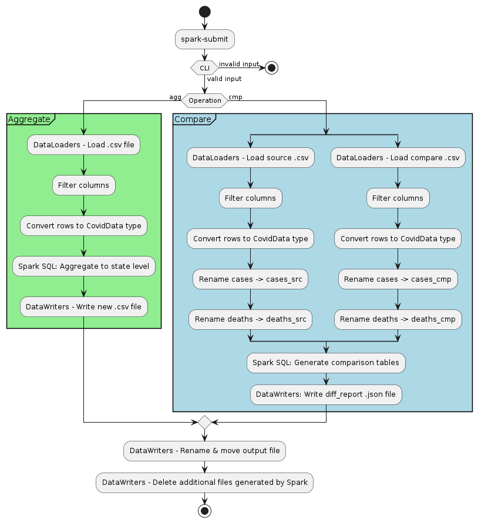

# Project Documentation

## Batch Design
This batch is designed for two operations:
1. Aggregate: Expects a .csv file with Covid19 cases/deaths time series data split by _city_ and aggregates by _state_
2. Compare: Expects two .csv files with Covid19 cases/deaths time series data and generates a comparison report

The user specifies which operation is to be performed from the command line:
- `... "agg" path/to/city/data.csv output/filename` launches the aggregation batch
- `... "cmp" path/to/source.csv path/to/compare.csv` launches the comparison batch

One particular feature of this design is that we always generate **one specific output file**, not a directory with one 
or more `part-xxxx-....` files. This is done by the [DataWriters.scala](../tracker/src/DataWriters.scala) object which
automatically moves and renames the file written by spark, and removes the additional files generated by the batch.

A general overview of the batch:

## Computing new_brazil_covid19.csv
The aggregation from city-level to state-level data is performed in 5 steps:

1. Once the source file is loaded as csv with headers, all non-relevant columns are removed
2. The remaining rows in the dataframe are parsed into a `CovidData` type
3. The resulting dataframe is loaded as temporary view for further processing with Spark SQL
4. Spark SQL is used to aggregate data by data and state
5. The resulting table is coalesced into one file and written disk in `.csv` format

## Generating the comparison diff_report.json
The comparison between two dataframes is performed in X steps:

1. Both files are loaded as csv with headers and all columns not relevant to the comparison are dropped
2. The remaining rows in both dataframes are converted to a `CovidData` type
3. Columns needed for the comparison are renamed to avoid collisions 
4. Both data frames are loaded as temporary views for further processing with Spark SQL
5. Spark SQL is used to compose a table based on the following actions:
   1. Count rows in the source table and the comparison table
   2. Count rows (based on date and state values) that are only present in the one table but not the other
   3. Count rows in which the cases and death values for a given key match
   4. Count rows in which the cases and death values for a given key do not match
6. The resulting table is coalesced into one file and written to disk in `.json` format

## Comparison Observations
The `diff_report.json` file shows some expected and unexpected differences between the provided and my generated file:

### Number of Rows
The provided file `brazil_covid19.csv` has 837 lines that are not present in my generated file 
`new_brazil_covid19.csv`. This difference is expected because the provided file covers the timeframe from 2020-02-25 to
2021-05-23 while the generated file `new_brazil_covid19.csv` only covers 2020-03-27 to 2021-05-23. Given that we have 
27 states - meaning 27 entries per day - and 31 days time difference, we see that `27*31=837` is exactly the difference 
we shold have.

### Row Values
7,393 rows in both files have identical values in the `cases` and `deaths` columns but 4,037 rows have 
different values. This means two unexpected differences in our files:

  1. We should have the same number of cases and deaths for each day
  2. The sum of days with identical and with different values should be 11,421 but is 11,430

I only have theories for the differences:

  - Regarding the 4,037 rows with different values, one possible solution is an error in my algorithm. However, I 
  believe it is also likely that the provided file was calculated slightly different from the file I generated, for 
  example taking into consideration some municipalities that do not appear in the cities list, or with a different time 
  of day as cutoff to count a case or death for today or today - 1. I would need to dig deeper into the numbers to see
  the actual reason for these differences.

  - Regarding the sum of 11,430 rows, there has to be an error in the way in which I compute rows with equal and unequal 
values ... but I can't find it.